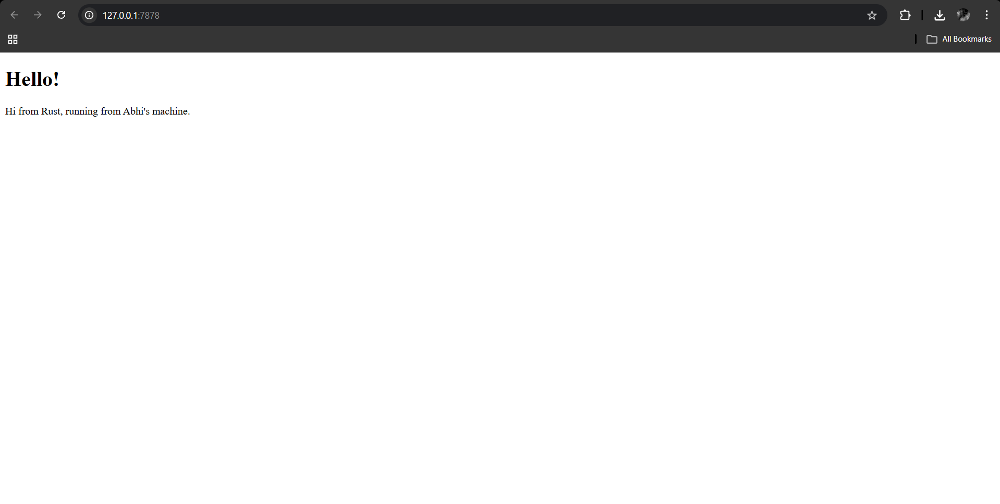
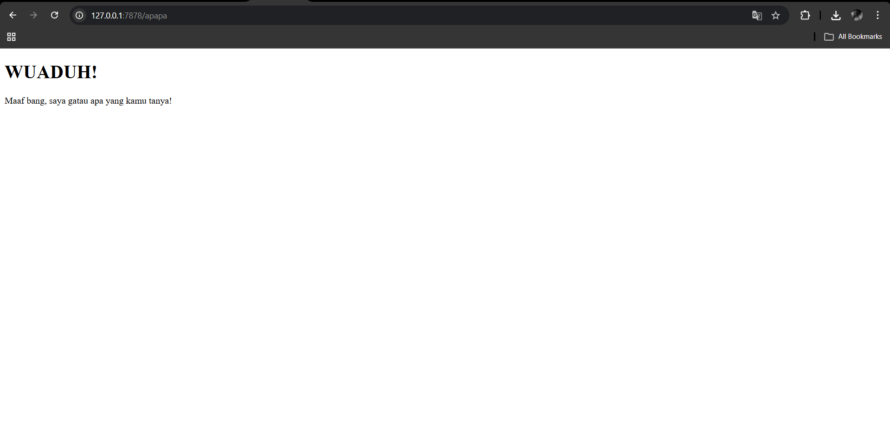

# advprog-modul6

## Commit 1 Reflection notes

Pada commit ini, saya mengimplementasikan *single-threaded web server* dasar menggunakan `TcpListener` untuk mendengarkan koneksi TCP pada `127.0.0.1:7878`. Di dalam fungsi `handle_connection`, setiap request dari *client* (browser) dibaca lebih efisien menggunakan `BufReader` baris demi baris hingga menemukan baris kosong yang menandakan akhir dari HTTP *header*. Setelah itu, seluruh isi request tersebut dikumpulkan dan dicetak ke terminal, sehingga saya bisa melihat secara langsung format request HTTP mentah (seperti *method*, *path*, dan *header*) yang dikirimkan oleh browser. Proses ini memberikan saya pemahaman yang lebih jelas mengenai alur komunikasi awal antara *client* dan *server*.

## Commit 2 Reflection notes

Pada commit kedua ini, saya mengembangkan server agar tidak hanya membaca request, tetapi juga mampu memberikan respons HTTP yang valid kepada *client*. Saya menambahkan logika *routing* sederhana untuk mengecek baris pertama request; jika request tersebut adalah "GET / HTTP/1.1", server akan membaca file `hello.html` dari sistem menggunakan modul `fs` di Rust. Setelah itu, server menyusun format respons HTTP standar yang memuat *status line* `HTTP/1.1 200 OK`, *header* `Content-Length`, serta isi HTML tersebut sebagai *body*, lalu mengirimkannya kembali ke browser melalui `stream.write_all()`. Melalui tahap ini, saya jadi lebih paham mekanisme bagaimana web server mengambil file lokal dan mengembalikannya dalam bentuk respons HTTP utuh yang bisa dirender menjadi halaman web oleh browser.

## Commit 3 Reflection notes

Pada commit ketiga ini, saya menambahkan penanganan *error* untuk *path* yang tidak dikenali dengan mengembalikan respons `404 NOT FOUND` beserta halaman `404.html`. Selain itu, saya melakukan *refactoring* pada fungsi `handle_connection` untuk menghilangkan duplikasi kode. Daripada menulis ulang logika pembacaan file dan penyusunan respons HTTP di dalam blok `if` dan `else`, saya menggunakan blok percabangan tersebut hanya untuk menentukan *status line* dan nama file yang tepat. Logika pembacaan dan pengiriman respons diletakkan di akhir fungsi sehingga kode menjadi jauh lebih ringkas, bersih, dan mudah dikelola (DRY - *Don't Repeat Yourself*).

## Commit 4 Reflection notes

Pada commit keempat ini, saya mensimulasikan respons server yang lambat (*slow request*) dengan menambahkan *endpoint* `/sleep` yang akan menghentikan *thread* selama 10 detik menggunakan `thread::sleep()`. Selain itu, saya mengubah struktur kontrol `if-else` menjadi `match` agar penambahan rute-rute baru nantinya menjadi lebih rapi. Melalui simulasi ini, kelemahan utama dari *single-threaded server* terlihat sangat jelas: ketika saya mengakses `/sleep` di satu *tab* browser dan kemudian mengakses `/` di *tab* lain, *request* kedua tertahan dan harus menunggu sampai *request* pertama selesai diproses. Fenomena *bottleneck* ini membuktikan bahwa server dengan satu *thread* tidak ideal untuk menangani banyak koneksi secara bersamaan, sehingga diperlukan implementasi *multi-threading* agar server dapat memproses beberapa *request* secara paralel (*concurrent*).

## Commit 5 Reflection notes

Pada commit kelima ini, saya mengimplementasikan *Multithreaded Server* menggunakan konsep *Thread Pool*. Alih-alih membuat *thread* baru tanpa batas untuk setiap koneksi (yang rentan terhadap serangan DoS), server kini dikonfigurasi untuk memiliki sekumpulan *worker threads* dengan jumlah tetap (dalam kasus ini 4). Koneksi yang masuk dikirim ke *channel* dan akan diambil oleh *worker* yang sedang menganggur untuk diproses secara paralel. Melalui arsitektur ini, fenomena antrean macet pada single-thread berhasil diatasi; saat request lambat seperti `/sleep` menahan satu *worker*, tiga *worker* lainnya tetap tersedia untuk merespons request pengguna lain ke *endpoint* `/` secara instan, sehingga *throughput* dan performa server meningkat tajam.

## Commit Bonus Reflection notes

Pada tahap bonus ini, saya mengganti fungsi `ThreadPool::new` dengan `ThreadPool::build` untuk meningkatkan keamanan program (error handling). Fungsi `new` sebelumnya menggunakan macro `assert!` yang akan langsung memicu *panic* (menghentikan program secara paksa dan mendadak) jika jumlah *thread* yang diminta adalah 0. Ini bukan praktik yang baik untuk lingkungan *production*. Sebagai gantinya, fungsi `ThreadPool::build` diimplementasikan untuk mengembalikan tipe `Result`. Dengan `Result`, jika ukuran *thread pool* tidak valid, fungsi akan mengembalikan `Err` yang berisi pesan kesalahan. Hal ini memungkinkan *caller* di `main.rs` untuk menangani *error* tersebut secara lebih elegan (graceful), misalnya dengan mencetak pesan peringatan menggunakan `eprintln!` dan menutup program dengan kode *exit* yang benar (`process::exit(1)`), alih-alih mengalami *crash* yang tidak terkendali.